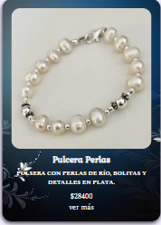
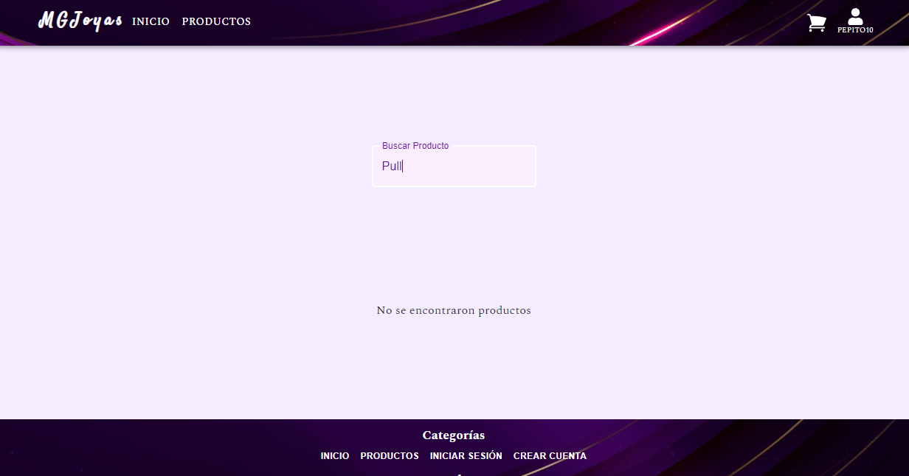

# MGJoyas

## Ecommerce

En este proyecto [MGJoyas](https://tienda--ada.web.app/) el usuario puede acceder a una página de venta de joyas en la cual puede añadir al carrito de compras los productos que desee adquirir. Los productos en el carrito duran 24 horas y después se borran.

En la vista de productos se muestran los artículos disponibles y poseen un botón que nos dirige al detalle del producto.

Desde ese detalle de producto, podemos agregar al carrito al tocar el botón "Agregar al carrito."

Esto se verá reflejado en el navbar, en el ícono de carrito, donde aparecerá un número indicando la cantidad de productos que están dentro del carrito.

<!-- Si ingresa a la pagina y se logea al comprar en el carrito lo llevará al checkout, si no lo está al hacer click en comprar lo enviará a login y si no posee cuenta a registrarse para poder hacer la compra

 -->

Estando en el carrito, se puede agregar más productos desde los botones para incrementar o disminuir la cantidad. También se puede eliminar un producto o vaciar por completo el carrito. Se va mostrando el cambio de dinero gastado a medida que sumamos productos en el subTotal que se muestra más abajo.

Al tocar "Comprar," nos lleva al checkout si el usuario está logeado, donde se puede finalizar la compra. Nos muestra la cantidad de productos y el total de nuestra compra.

Si el usuario no está logeado, se redirigirá a la página de login.

Una vez logeado, se lo llevará al checkout para finalizar la compra.

Si no está registrado, se lo llevará a registrarse, para que luego pueda realizar la compra.

Una vez terminada la compra, se le mostrará un modal para agradecer la compra, con un botón de "Regresar" que lo llevará al inicio.

El usuario además puede ver su historial de compras, donde se verá cuándo se realizó, qué productos compró, y el gasto realizado.

Esta página además tiene un buscador para encontrar los productos que se necesitan.

Y si no se encuentran, aparece la leyenda "No se encontraron productos."

También tiene una página 404 por si no se encuentra la URL.

Al final de la página se encuentra el footer, con un menú para navegar en la página, la forma de pago, y además se pueden ver las redes sociales.

## Construido

Las tecnologías que utilicé para construir este proyecto:

-React
-MUI
-Firebase
-Formik

## Autora

- ** MELIE GALAZ **

## Link para usar la app

https://tienda--ada.web.app/

# MGJoyas
